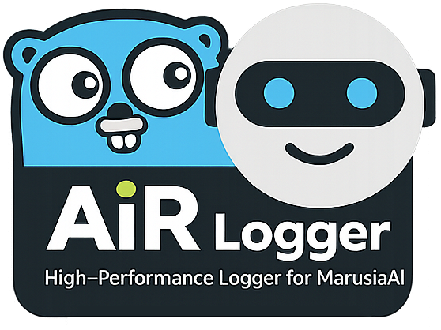

# AiR Logger

**Version:** `2`  
**License:** `MIT` (свободная лицензия)



Быстрый логгер для проекта **MarusiaAI** без внешних зависимостей.

## Что умеет

- встроенная ротация файлов
- уровни логирования `DEBUG`, `INFO`, `WARNING`, `ERROR`, `FATAL`
- fluent API через `SetPatch(...).With...().Apply()` и `StdOut().With...().Apply()`
- опциональное отключение `caller` для ускорения
- специальная поддержка `userID`, если он передан **последним аргументом** как `uint32`

## UserID последним параметром

Если последним аргументом передан `uint32`, логгер автоматически добавляет его в строку в виде `[USER:<id>]`.

```go
userID := uint32(12345)
logger.Info("Пользователь вошел", userID)
// 2026/05/05 13:21:22 main.go:10: [INFO] [USER:12345] Пользователь вошел
```

## Быстрый старт

```go
package main

import "github.com/ikermy/air-logger/v2/pkg/logger"

func main() {
logger.SetPatch("./logs/app.log").Apply()
	defer logger.Close()

	logger.Info("service started")
	logger.Warn("cache miss")

	userID := uint32(42)
	logger.Info("user action", userID)
}
```

## Конфигурация

```go
logger.SetPatch("./logs/app.log").
	WithLogLevel(logger.INFO).
	WithMaxSize(10).
	WithMaxBackups(5).
	WithMaxAge(30).
	WithCompress(true).
	WithCaller(true).
	Apply()
```

Доступные настройки:

- `WithLogLevel(level)`
- `WithMaxSize(mb)`
- `WithMaxBackups(count)`
- `WithMaxAge(days)`
- `WithCompress(enabled)`
- `WithCaller(enabled)`

Для режима только stdout:

```go
logger.StdOut().
	WithLogLevel(logger.INFO).
	WithCaller(false).
	Apply()
```

В режиме `StdOut()` доступны только настройки уровня логирования и caller. Методы `WithMaxSize`, `WithMaxBackups`, `WithMaxAge`, `WithCompress` относятся только к файловому режиму через `SetPatch(...)`.

## Формат логов

С `caller`:

```text
2026/05/05 13:21:22 main.go:15: [INFO] [USER:42] user action
```

Без `caller`:

```text
2026/05/05 13:21:22: [INFO] user action
```

## Производительность

Актуальные локальные замеры на моих попугаях:

| Сценарий | Time | Memory | Allocs |
|---|---:|---:|---:|
| `BenchmarkLogMessageConcatNew` | 204.2 ns/op | 68 B/op | 2 allocs/op |
| `BenchmarkWriteLogFullPath` | 548.1 ns/op | 352 B/op | 5 allocs/op |
| `BenchmarkWriteLogNoCaller` | 125.9 ns/op | 101 B/op | 2 allocs/op |
| `BenchmarkDebugDisabled` | 12.08 ns/op | 8 B/op | 0 allocs/op |
| `BenchmarkStdOutApply` | 4.044 ns/op | 0 B/op | 0 allocs/op |

Для максимально быстрого режима:

```go
logger.SetPatch("./logs/app.log").
	WithCaller(false).
	Apply()
```

## Docker

Для контейнеров используйте вывод только в stdout:

```go
logger.StdOut().
	WithLogLevel(logger.INFO).
	WithCaller(false).
	Apply()
```

В этом режиме логгер не создаёт файл и не использует ротацию.

## Выборка логов пользователя

```go
userID := uint32(42)
err := logger.GetUserLogs("./logs/app.log", userID, func(line string) {
	println(line)
})
if err != nil {
	panic(err)
}
```

## Команды

```powershell
go test ./pkg/logger -v
go test ./pkg/logger -bench=. -benchmem -run=^$ -count=1
```

## Структура репозитория

```text
pkg/logger/    основной пакет
examples/      примеры использования
logo.png       логотип проекта
README.md      основная документация
LICENSE        лицензия
```

## Лицензия

Свободная лицензия MIT. Подробности в `LICENSE`.
